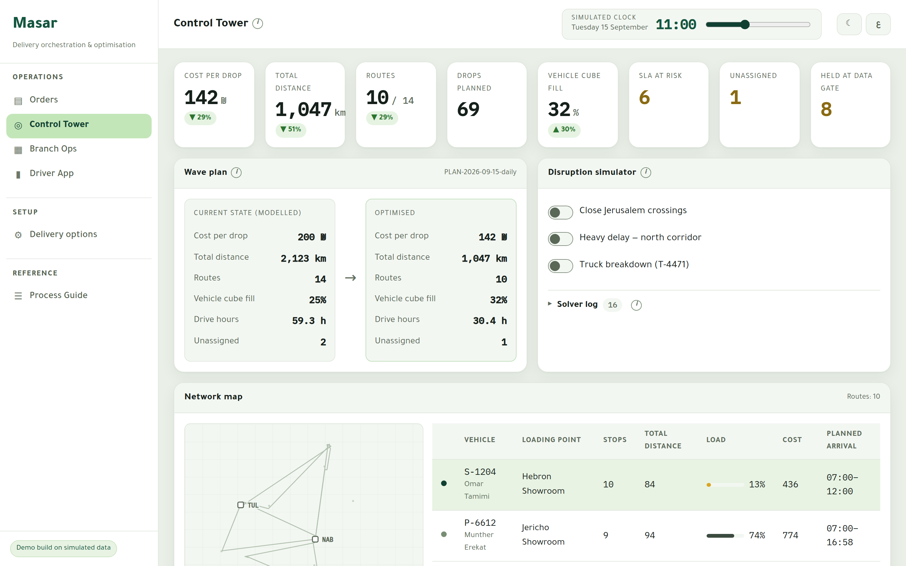
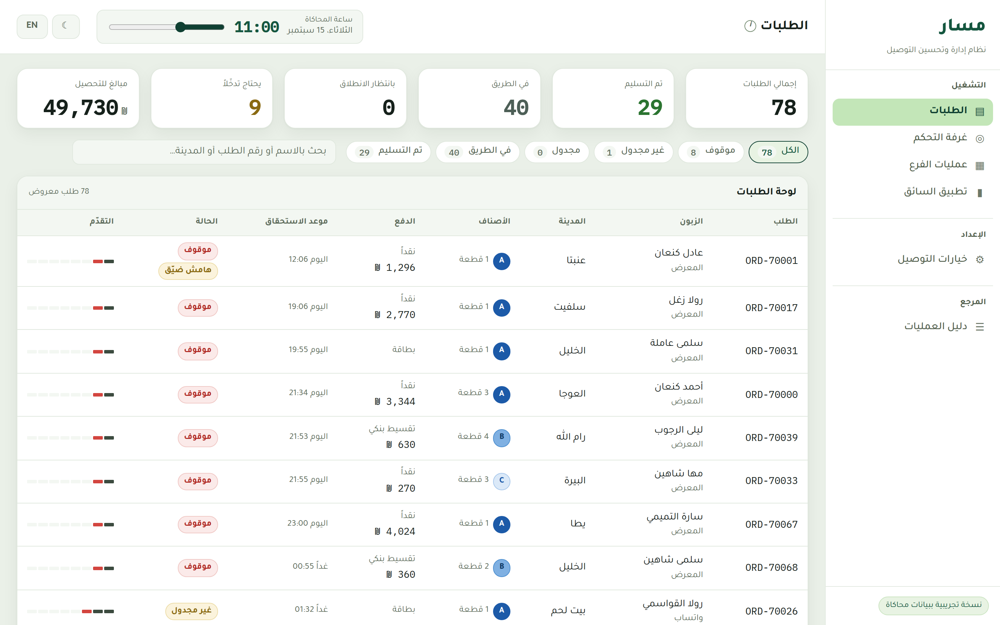

# مسار · Masar

[](https://github.com/ramiabukhader/Masar-System/actions/workflows/ci.yml)

**[Open the live demo →](https://ramiabukhader.github.io/Masar-System/)** — runs entirely in
the browser, on simulated data, Arabic-first with an English toggle.

**Delivery orchestration and route optimisation for a home-appliance retailer that runs
its own delivery fleet.**

A working demo of a system to automate and optimise a multi-branch retailer's delivery
operation: free delivery within 48 hours, with installation, across a corridor-shaped and
access-constrained network — currently run branch-by-branch, at a cost the business feels
but cannot yet measure.

It was designed against a real retail operation in the West Bank. The retailer's name and
the details that would identify it are left out of this repository, and every order,
customer and cost figure in the demo is simulated.





---

## What is in here

| | |
|---|---|
| **`docs/`** | The research, the strategy, the architecture and the process manuals |
| **`src/core/`** | The real planning engine — domain model, travel model, optimiser |
| **`src/data/`** | A seeded West Bank scenario: gazetteer, branch network, brand catalogue, fleet |
| **`src/ui/`** | The application — orders board, order detail, Control Tower, Branch Ops, Driver App, delivery options, roadmap, process guide |
| **`masar-demo.html`** | Generated single-file build. Regenerated by `npm run build:standalone` |

### Documents

| Doc | What it answers |
|---|---|
| [`01-research-dossier.md`](docs/01-research-dossier.md) | Who the retailer is, what it sells, how it sells it, and where the delivery cost actually leaks |
| [`02-target-operating-model.md`](docs/02-target-operating-model.md) | The path: what changes, in what order, and what each change is worth |
| [`03-architecture.md`](docs/03-architecture.md) | How Masar plugs into the retailer's existing PHP stack without owning it |
| [`04-data-model-and-db-integration.md`](docs/04-data-model-and-db-integration.md) | The canonical model, the adapter contract, and the product-dimension gap that gates everything |
| [`05-optimization-spec.md`](docs/05-optimization-spec.md) | What the optimiser solves and how |
| [`06-sop-en.md`](docs/06-sop-en.md) | End-to-end SOPs, English |
| [`07-sop-ar.md`](docs/07-sop-ar.md) | نفس الإجراءات بالعربية — للفريق والسائقين |
| [`09-industry-benchmarks.md`](docs/09-industry-benchmarks.md) | How Coolblue, John Lewis, Lowe's, Home Depot and Best Buy run own-fleet delivery — and the four things we changed because of it |

---

## Running it locally

The live demo needs nothing installed. To run it on your own machine instead — it works
with no internet connection:

### Option A — just open the file

```bash
npm install
npm run build:standalone     # writes masar-demo.html
```

`masar-demo.html` is a single self-contained file — double-click it and the whole
application opens in your browser. No server, no terminal, nothing to install on the
machine you demo from, and no network: the typeface is embedded in the file along with
everything else, so it renders identically on a branch PC with no internet. A pre-built
copy is committed at the repository root, so you can also download that one file on its
own and open it.

### Option B — the dev server, for making changes

```bash
npm install
npm run dev        # http://localhost:5173, hot reload
npm test           # 61 tests over the planning engine, order lifecycle and promise engine
```

### للتشغيل محلياً

```bash
npm install
npm run build:standalone
```

ثم افتح ملف `masar-demo.html` بالضغط عليه مرتين — يعمل كاملاً بدون إنترنت وبدون خادم.
الواجهة عربية بالكامل من اليمين إلى اليسار، مع زر تبديل إلى الإنجليزية في الأعلى.

---

## Hosting the demo

It is a static bundle — no server, no database, no API, no secrets — so it can be hosted
anywhere that serves files, or not hosted at all.

### Send the file

```bash
npm run build:standalone     # → masar-demo.html
```

One self-contained file, about 625 KB with the typeface embedded. Double-click to open.
Email it, put it on a USB stick, or open it on the laptop you present from. No server, no
account, no URL — for a demo shown in a meeting this is simply the right answer.

### GitHub Pages — the live demo

`.github/workflows/pages.yml` publishes the production build to GitHub Pages on every push
to `main`, and can also be run by hand from the Actions tab; the live demo linked at the
top is that deployment. It needs no API key — it authenticates with the `GITHUB_TOKEN`
Actions mints for the single run, scoped to this repository and expiring with the job.
Nothing to store, rotate or revoke. Pages has to be switched on once, under
**Settings → Pages → Source: GitHub Actions**; the workflow attempts that itself on its
first run.

### Vercel and Render

`vercel.json` and `render.yaml` are committed. Import the repository and either platform
picks up the Vite preset with no input. Whichever you pick, grant its GitHub app access to
**this repository only**, never to the whole account.

### Search engines

Nothing blocks indexing: there is no `robots.txt` and no `noindex` tag, so the live demo
can be found by search. Add either back if a hosted copy should stay unlisted.

### Continuous integration

`.github/workflows/ci.yml` runs the test suite and a production build on every push and
pull request, then rebuilds `masar-demo.html` and fails if the committed copy has drifted
from the source.

### Settings, wherever you land

| | |
|---|---|
| Build command | `npm run build` |
| Output directory | `dist` |
| Node version | 20 or 22 |

No environment variables, no secrets, no build-time configuration. The seeded scenario is
compiled into the bundle, so a deploy is reproducible and there is nothing to leak.

---

## Theming

Every colour in the application resolves through one token block at the top of
[`src/ui/styles.css`](src/ui/styles.css); no component writes a raw colour. The brand is
eight values:

```css
--brand:          /* solid fills, marks, the heavy chart series         */
--brand-strong:   /* hover / pressed — darker on light, lighter on dark */
--brand-ink:      /* brand-coloured text on the working surface         */
--brand-wash:     /* tinted fill behind brand elements                  */
--brand-line:     /* brand-tinted border                                */
--brand-contrast: /* text sitting ON the brand colour                   */
--brand-soft:     /* the light highlight fill — the active nav pill     */
--brand-soft-ink: /* text sitting ON the soft fill                      */
```

Change those and the whole app re-skins: navigation, buttons, focus rings, selection, map
highlight.

**The default palette is a deep forest green on a light surface** — a sage page ground,
white cards floating on it with a shadow you barely see, a white sidebar separated from the
content by a hairline, and two greens doing all the identity work: a near-black forest for
weight and a soft green for the highlight. Light is the default, because a dispatcher reads
this screen for ten hours; the dark theme is one click away in the top bar
(`[data-theme='dark']`).

**The one compromise this palette makes:** with a green brand, "done" green is no longer a
hue nothing else uses. It is held apart by value — the brand is a very dark forest, the
status green a mid green — and the two never appear in the same role.

Only **one hue is saturated on the working surface at a time**. That is the difference
between this palette and a noisy one: the brand lives in the chrome, the class ramp is a
single blue, progress is graphite, and the three status hues appear only inside small
labelled chips. The amber is pushed toward yellow and its wash toward cream, because "at
risk" must never read as a brand element.

Going dark is not a token swap. Three things invert, and every one of them is a bug if you
miss it:

- **A wash is a dark tint, not a pale one.** `--red-wash` is `#331b1a` here, not `#fbeae9`.
- **Ink goes lighter, not darker.** On white, status text is darkened for contrast; on a
  dark ground it has to be lightened. `--red` is `#b02a24` light and `#ff7d78` dark.
- **A "filled" meter is the lighter end.** `--progress` is graphite on white and bone on
  dark — and anything drawn *on* it needs `--progress-contrast`, which flips with it.
- **The class ramp reverses**, so the heaviest step stays the most prominent one.

Shadows also stop working (a soft dark shadow does nothing on a dark ground, so elevation
is carried by the panel fill and a deepened shadow), and `--green-solid` / `--red-solid`
exist because a white tick cannot sit on the light status ink that dark mode requires.

### Roles, not shades, keep the brand and the alarm apart

An operations screen has to keep one hue free to mean "something is wrong", and it must
never be confused with the colour that means "this is the system" or "this is done". Four
rules resolve it, and they are what stop the app from looking like everything is on fire:

| Role | Treatment | Where |
|---|---|---|
| Identity and action | forest green, solid; soft green for the active nav pill | primary button, selection, focus ring, the route you clicked |
| Alarm | red, pale wash + dark ink | blocked orders, missed windows, unavailable slots — chips only |
| Progress and completion | graphite (`--progress`) | milestone bars, timeline, load meters, step rails |
| Handling attributes | class-C pale blue / slate | "fragile", "needs installation" — properties of the goods, not problems |

The last row matters more than it looks: half the kitchenware is fragile, and a red chip
on every one of those rows teaches a loader to ignore red by Tuesday.

Status colours (green / amber / red) and the product-class palette are deliberately *not*
derived from the brand, and should not be changed with it.

The product classes are **one blue in three steps**, not three hues. A, B and C are not
unrelated categories — they are an ordinal handling scale (bulky white goods → small
appliances → fragile kitchenware), and a sequential ramp is the correct encoding for that.
It is also the calm one: three saturated hues on every row of a 78-row table was most of
what made the earlier palette noisy, and every triad of distinct hues that survives a
colour-vision check on white fails on a dark ground (blue and violet collapse under
protanopia at ΔE 1.9 against a floor of 8). The ramp sidesteps that entirely — lightness is
the one channel colour-vision deficiency cannot take away. It passes the ordinal check in
both themes: monotone lightness, every adjacent gap at or above ΔL 0.06, single hue within 4°.

The chip carries the step as its **fill**, not as a tint, so A / B / C read as dark → mid →
pale at a glance; each step's letter clears 4.5:1 against its own fill.

---

## The application

Seven screens, Arabic-first RTL with an English toggle in the top bar. A **simulated
clock** in the header drives the whole application — drag it and the delivery day replays:
at 07:20 the trucks have just left and nothing is delivered; by 15:00 most stops are
closed and the ones still open are exactly the ones worth looking at.

**Operations**

- **الطلبات · Orders** — the home page. Every customer order in the wave with its live
  state, searchable and filterable, sorted so anything needing a human comes first. Click
  any order to open it.
- **تفاصيل الطلب · Order detail** — the follow-up view: an eight-step milestone timeline
  from the sale to the signed proof, the customer and access survey, the items with their
  cube and installation needs, the assigned route, vehicle and crew, and the activity log.
  Blocked orders say what stopped them **and who has to do what next**.
- **غرفة التحكم · Control Tower** — the wave plan, cost and SLA risk, network map, and a
  disruption simulator: close a crossing or take a truck off the road and the whole wave
  re-optimises in front of you.
- **عمليات الفرع · Branch Ops** — pick list and the LIFO loading manifest with in-box
  position and scan verification.
- **تطبيق السائق · Driver App** — the crew's phone: navigate, arrive, access check,
  installation checklist, functional test, proof of delivery, payment, coded exceptions.

**Setup**

- **خيارات التوصيل · Delivery options** — opens with the **promise engine**: the slots the
  network can actually serve in a given zone right now, with the cheapest one to serve
  labelled. That is the John Lewis practice — book the slot while the customer is still in
  the showroom, instead of confirming a window by message the day before. Below it, the
  service tiers: what can be promised, to whom, and what it costs to serve. Same-day sits
  there deliberately as a switched-off option carrying the five prerequisites that must be
  true before it can be turned on.

**Reference**

- **دليل العمليات · Process Guide** — all 23 steps from sale to close-out, each with its
  owner and the specific loss its guard prevents.
- **خارطة الطريق · Roadmap** — programme milestones by phase, including what is already
  built, so progress can be judged rather than asserted.

## What is real and what is simulated

Being precise about this matters more than the demo looking impressive.

**Real:**
- The optimiser. Regret-2 insertion plus local search, with every hard constraint enforced —
  cube, payload, crew size, installation certification, zone eligibility, staging origin,
  customer window, SLA deadline, shift length. It is the same `runWave` a production job
  would call.
- The travel model's *shape*: time-dependent, asymmetric, with explicit zone-crossing costs
  and closures as impassable arcs.
- The service-time model: handling, installation, stairs and lifts, doorstep payment.
- The branch network, brand portfolio, delivery promise and damage policy — from the
  retailer's own public information.

**Simulated, and to be replaced with the retailer's data:**
- Orders, customers and stock positions are generated from a fixed seed.
- Product dimensions are representative, not measured. **This is the single biggest
  integration dependency** — see [`docs/04` §4](docs/04-data-model-and-db-integration.md).
- Travel times come from zone-pair circuity factors and hourly profiles, not a road network.
  Production swaps in OSRM plus per-arc profiles learned from the fleet's own GPS traces.
- Fleet composition, vehicle costs and the distribution centre location are assumptions
  pending discovery.
- **The before/after comparison is a modelled counterfactual**, not a measurement. It shows
  the shape of the saving. The real baseline is measured from their own history in Phase 1,
  and that number — not this one — is what the programme should be judged against.

Every assumption in the research is tagged **[V]** verified, **[I]** inferred, or **[?]**
must be confirmed. Nothing tagged **[?]** should be presented to the client as fact.

---

## The argument in five lines

1. Delivery is free to the customer, so every wasted kilometre comes straight off margin.
2. A 48-hour deadline with no agreed arrival window is the direct cause of failed first
   attempts — the most expensive event in the network.
3. Branch-siloed dispatch duplicates kilometres that consolidation removes.
4. Trucks are planned by order count, not by cube, so they leave half empty.
5. None of it is measured, which is why it feels unorganised.

Keep the 48-hour promise. Add the window. Consolidate into waves. Plan by cube. Measure
cost per drop. Same-day comes later — and only once the base network is efficient enough
to carry it.

---

## Status

Version 1 of the demo — built to be shown, then improved. Not connected to any live
system, and holding no real customer data. The integration contract is deliberately narrow: read orders, customers, products,
inventory and branches from a read-replica; write back one thing — delivery status.
